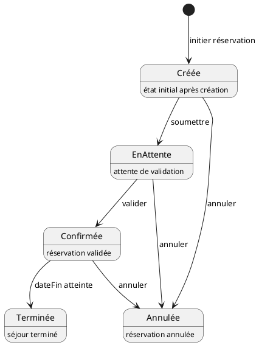

# rendu3-2025
**Raffinement du diagramme de classes pour le système de réservation d'hôtel**

---

### Classe Utilisateur
```plaintext
Utilisateur
-------------
+ id : int (unique)
+ nom : string
+ email : string (unique, non null)
+ motDePasse : string (non null)
```

---

### Classe Client (hérite de Utilisateur)
```plaintext
Client : Utilisateur
-------------
+ listeReservations : List<Reservation>
```

---

### Classe Administrateur (hérite de Utilisateur)
```plaintext
Administrateur : Utilisateur
-------------
+ listeChambresGerees : List<Chambre>
```

---

### Classe Chambre
```plaintext
Chambre
-------------
+ numero : int (unique)
+ type : string  // Ex: Simple, Double, Suite
+ prix : float (>= 0)
+ etat : string  // Ex: Libre, Réservée, En nettoyage
```

---

### Classe Reservation
```plaintext
Reservation
-------------
+ id : int (unique)
+ dateDebut : Date
+ dateFin : Date
+ statut : string  // Ex: Confirmée, Annulée, En attente

+ client : Client
+ chambre : Chambre
```

---

### Contraintes supplémentaires :
- `dateDebut < dateFin`
- Une `Chambre` ne peut être concernée que par une seule réservation sur une période donnée.
- Un `Client` peut effectuer plusieurs réservations.
- Une `Chambre` est gérée par un seul `Administrateur`.

---

### Diagramme état-transitions (cycle de vie de `Reservation`) en PlantUML


---

### Traduction des associations et compositions (Raffinement 2)

#### Associations -> Attributs :
- `Reservation` contient un attribut `client : Client`
- `Reservation` contient un attribut `chambre : Chambre`
- `Client` a une `listeReservations : List<Reservation>`
- `Administrateur` gère une `listeChambresGerees : List<Chambre>`

#### Agrégations/Compositions :
- Composition implicite entre `Reservation` et `Client` : une réservation n'existe que si un client existe.
- Composition entre `Chambre` et `Reservation` (temporaire pendant la période de réservation).

---

### Traduction des diagrammes de séquence et états en algorithmes

#### Exemple d'algorithme : Création d'une réservation
```pseudo
fonction creerReservation(client, chambre, dateDebut, dateFin):
    si chambre.estDisponible(dateDebut, dateFin):
        reservation = nouvelle Reservation()
        reservation.client = client
        reservation.chambre = chambre
        reservation.dateDebut = dateDebut
        reservation.dateFin = dateFin
        reservation.statut = "En attente"
        client.ajouterReservation(reservation)
        retourner reservation
    sinon:
        afficher("Chambre non disponible")
        retourner null
```

#### Exemple d'algorithme : Validation de réservation par l'administrateur
```pseudo
fonction validerReservation(reservation):
    si reservation.statut == "En attente":
        reservation.statut = "Confirmée"
```

#### Exemple d'algorithme : Annulation
```pseudo
fonction annulerReservation(reservation):
    si reservation.statut != "Terminée":
        reservation.statut = "Annulée"
```

#### Exemple d'algorithme : Fin de réservation automatique
```pseudo
fonction verifierReservations(dateActuelle):
    pour chaque reservation dans toutesReservations:
        si reservation.dateFin < dateActuelle et reservation.statut == "Confirmée":
            reservation.statut = "Terminée"
```

